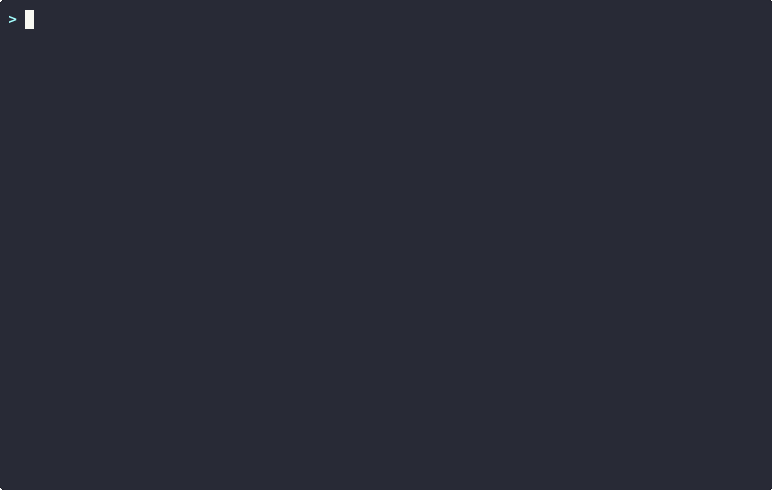

# README Roast — GIF Demo Recording Script

## Setup (before recording)

```bash
# Install recording tools
brew install asciinema
brew install agg

# Terminal settings
# - 90 columns wide, 24 rows tall
# - Dark theme (Monokai, Dracula, or your default dark)
# - Font size 14-16pt so it's readable in a GIF
# - Clear any clutter from the terminal

# Navigate to the repo
cd ~/Downloads/readme-roast

# Start Claude Code
claude
```

## Recording

Open a NEW terminal tab and run:

```bash
# This records your terminal session to a file
asciinema rec assets/demo.cast --cols 90 --rows 24
```

Then switch back to the terminal with Claude Code running.

---

## Scene 1: The Roast (the money shot)

Type this:

```
/readme-audit https://github.com/hidai25/eval-view
```

**What the viewer sees:**
- "Fetching README..."
- 3 agents launching in parallel (the tree view)
- Agents completing one by one
- **The score table appearing** ← THIS is the screenshot moment
- Star killers list

**Wait for full output.** Let the score table sit on screen for 2-3 seconds.

---

## Scene 2: The History

Type this:

```
/readme-history
```

**What the viewer sees:**
- Score progression bars: #1 47/100 → #2 64/100
- Category trends with arrows (▲+30 Install, ▲+26 Trust, etc.)
- "Key Changes That Moved the Needle"
- Patterns Fixed / Still Missing

**Let it sit for 2-3 seconds so people can read the progression.**

---

## Scene 3: Quick Star Killers (clean ending)

Type this:

```
/readme-star-killers
```

**What the viewer sees:**
- Top 3 issues with specific fixes
- "Fix all three → estimated score: X/100"
- Clean, punchy ending

---

## Stop Recording

Press `Ctrl+D` or type `exit` to stop the asciinema recording.

---

## Convert to GIF

```bash
# Basic conversion (2x speed)
agg assets/demo.cast assets/demo.gif --theme monokai --font-size 14 --speed 2

# If the GIF is too large (>5MB), increase speed or trim
agg assets/demo.cast assets/demo.gif --theme monokai --font-size 14 --speed 3
```

### Trimming (if needed)

The `.cast` file is a text file. Each line has a timestamp. You can:

1. Open `assets/demo.cast` in a text editor
2. Find the long pauses (agent execution time) — look for big timestamp gaps
3. Reduce those gaps to 1-2 seconds
4. Save and re-run `agg`

Example: if line 50 is at timestamp 10.5 and line 51 is at 285.3 (agent took ~5 min), change 285.3 to 12.5 so it looks like 2 seconds.

---

## Add to README

Once you have the GIF:

```markdown
<!-- Add right after the intro paragraph, before Table of Contents -->
<p align="center">
  
</p>
```

---

## Tips

- **Don't rush typing.** The `--speed 2` flag will make it fast in the GIF.
- **Let outputs breathe.** Wait 2-3 seconds after each result renders.
- **Clean terminal.** Clear before starting. No prior output visible.
- **Maximize contrast.** Dark background, light text, no transparency.
- **Target GIF size:** Under 5MB for fast GitHub loading. Under 3MB is ideal.
- **If asciinema is annoying:** Use [Kap](https://getkap.co) (Mac) to screen-record a region of your terminal, export as GIF. Less control but faster.
